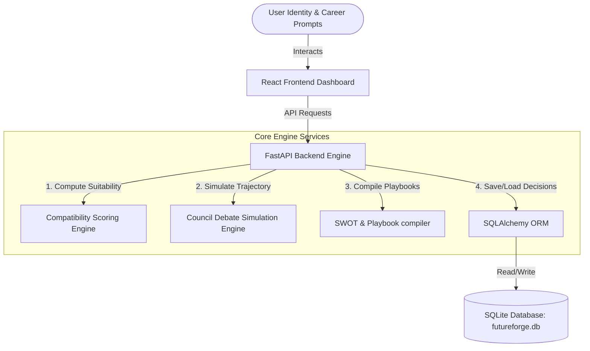
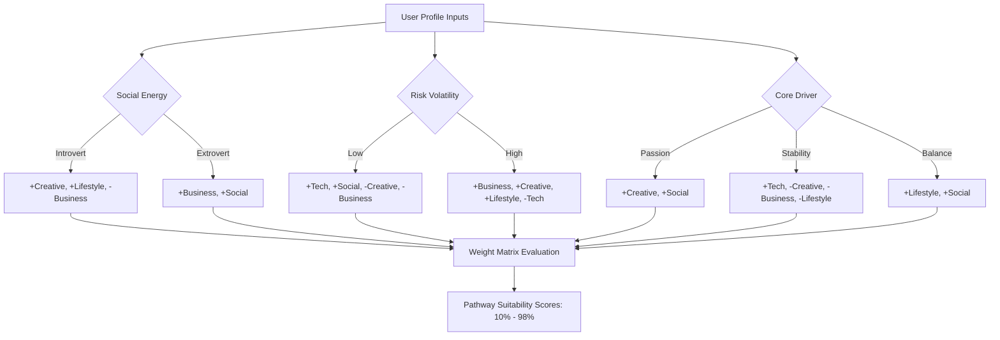
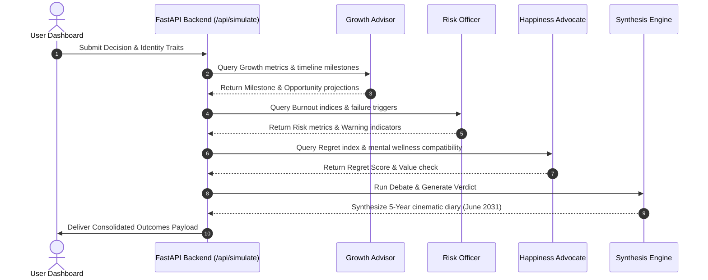
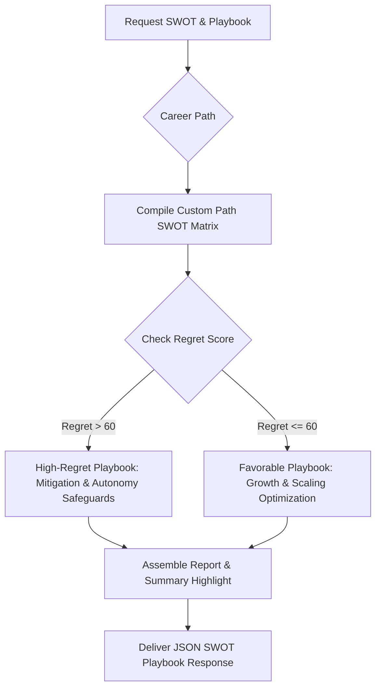

# FutureForge AI 🚀

🔗 Live Website: https://future-forge-ai-liart.vercel.app

### Enterprise-Grade Career Decision Intelligence & Trajectory Council Engine

FutureForge AI is a state-of-the-art career trajectory intelligence platform. By combining **psychometric identity parameters** (Social Energy Mode, Volatility/Risk Tolerance, and Core Life Drivers) with **decision analysis models**, the application simulates the long-term impacts of career actions. It features an interactive **Trajectory Council Debate** (consisting of simulated Growth, Risk, and Happiness advisors), projects five-year milestones across best/average/worst-case scenarios, drafts cinematic future projections (Year-5 diary entries), and builds tailored SWOT analyses and risk-mitigation playbooks.

---

## 🗺️ System Architecture

FutureForge AI is built using a modern decoupled architecture:
*   **Frontend**: React (built with Vite) featuring a glassmorphic dark-theme dashboard, dynamic gauges, and active tab routing.
*   **Backend**: FastAPI (Python) hosting the core simulation, suitability, and report compilers.
*   **Database**: SQLite managed via SQLAlchemy ORM for high performance, local data persistence, and shareable vaults.



---

## 🧠 Core Engineering & Algorithmic Workflows

### 1. Identity-to-Pathway Suitability Logic

The platform calculates suitability scores (from 10% to 98%) across five specialized career pathways: **CREATIVE**, **BUSINESS**, **TECH**, **LIFESTYLE**, and **SOCIAL**. The calculation takes a user's psychological parameters and applies algebraic weights to model baseline suitability.



### 2. Trajectory Council Debate Execution

When a career decision is simulated, the engine first maps the decision text to a career pathway (using keyword tokenization), then invokes three advisory components to run a virtual consulting debate.



### 3. SWOT Matrix & Playbook Compiler

Based on the simulated career pathway, computed regret score, and identity traits, the Report Compiler constructs a custom SWOT (Strengths, Weaknesses, Opportunities, Threats) analysis and drafts a structured mitigation playbook.



---

## 🗄️ Database Schema

Decisions are saved inside `futureforge.db` in the `decisions` table. The model fields are structured as follows:

| Column Name | SQLite Data Type | Description |
| :--- | :--- | :--- |
| `id` | `VARCHAR` (PK) | Unique primary key (prefixed with `ff_`) |
| `title` | `VARCHAR` | Auto-generated title summarizing the career pathway or option comparison |
| `mode` | `VARCHAR` | Simulation mode: `single` or `multiple` |
| `createdAt` | `VARCHAR` | ISO 8601 string timestamp of creation |
| `input` | `JSON` | User parameters (social mode, risk, core driver, decision prompts) |
| `results` | `JSON` | Complete council results, timeline curves, and diary narratives |
| `finalVerdict` | `JSON` | Consolidated summary, regret level, and performance metrics |
| `shareable` | `BOOLEAN` | Shareable link accessibility indicator |

---

## 🛠️ API Endpoint Specifications

All API requests and responses use JSON formatting. The core endpoints are defined below:

### 1. Evaluate Identity Profile Suitability
*   **Endpoint**: `POST /api/analyze-user`
*   **Description**: Evaluates user attributes to output pathway compatibility scores and a personalized summary.
*   **Request Payload**:
    ```json
    {
      "social": "introvert",
      "risk": "high",
      "priority": "passion"
    }
    ```
*   **Response Payload**:
    ```json
    {
      "compatibility_scores": {
        "CREATIVE": 98,
        "BUSINESS": 85,
        "TECH": 30,
        "LIFESTYLE": 85,
        "SOCIAL": 85
      },
      "recommended_paths": [
        "CREATIVE"
      ],
      "analysis": "Based on your profile as an introvert with a high risk tolerance and primary focus passion..."
    }
    ```

### 2. Simulate Career Trajectory
*   **Endpoint**: `POST /api/simulate-career` (alias: `POST /api/simulate`)
*   **Description**: Simulates the trajectory of a career decision, outputting advisor opinions, scenario bands, and cinematic stories.
*   **Request Payload**:
    ```json
    {
      "decisionMode": "single",
      "params": {
        "social": "introvert",
        "risk": "moderate",
        "priority": "balance",
        "decision": "Quit FAANG job to build an artisanal bakery",
        "decisionA": "",
        "decisionB": ""
      }
    }
    ```
*   **Response Payload**:
    ```json
    {
      "single": {
        "path": "CREATIVE",
        "debate": {
          "messages": [
            { "role": "Growth Advisor", "content": "..." },
            { "role": "Risk Officer", "content": "..." },
            { "role": "Happiness Advocate", "content": "..." }
          ],
          "verdict": {
            "title": "Deferred Launch (Side-Hustle Model)",
            "body": "..."
          }
        },
        "timeline": {
          "best": [ { "year": 1, "value": 50 }, "..." ],
          "average": [ { "year": 1, "value": 45 }, "..." ],
          "worst": [ { "year": 1, "value": 30 }, "..." ]
        },
        "regret": {
          "score": 45,
          "reasons": [ "..." ]
        },
        "story": "..."
      }
    }
    ```

### 3. SWOT Matrix and Risk Playbook Compilation
*   **Endpoint**: `POST /api/generate-report`
*   **Description**: Compiles a SWOT analysis and actionable mitigation steps.
*   **Request Payload**:
    ```json
    {
      "path": "CREATIVE",
      "regretScore": 45,
      "social": "introvert",
      "risk": "moderate",
      "priority": "balance"
    }
    ```
*   **Response**: Returns lists for strengths, weaknesses, opportunities, threats, a playbook array, and summary highlights.

---

## 📂 Project Directory Structure

```filepath
FutureForge AI/
├── backend/                    # FastAPI Application Root
│   ├── database.py             # SQLAlchemy configuration
│   ├── engine.py               # Algorithmic engine (V2 core calculations)
│   ├── main.py                 # FastAPI server router & endpoints
│   ├── models.py               # SQLAlchemy Database schemas
│   ├── requirements.txt        # Python dependency manifest
│   ├── schemas.py              # Pydantic request/response validation schemas
│   ├── simulation_engine.py    # Baseline trajectory simulation module
│   ├── test_api.py             # Engine unit tests
│   └── test_endpoints.py       # API endpoint integration tests
├── frontend/                   # React + Vite Client Dashboard
│   ├── index.html              # HTML Entry Point (Injects Inter & Space Grotesk font families)
│   ├── package.json            # Node.js dependency manifest
│   ├── vite.config.js          # Vite configurations + Backend /api proxy
│   └── src/
│       ├── main.jsx            # Application bootstrap
│       ├── App.jsx             # V2 Glassmorphic dashboard & controller
│       ├── App.css             # Main component styles
│       └── index.css           # Global design system variables & utility rules
├── dist/                       # Client Production Bundle target
└── futureforge.db              # Active SQLite Database File
```

---

## 🚀 Setup & Local Development

Follow these steps to spin up the local development environment on Windows:

### 1. Backend Setup (FastAPI)
1. Navigate to the `backend/` directory:
   ```powershell
   cd backend
   ```
2. Create and activate a python virtual environment:
   ```powershell
   python -m venv venv
   .\venv\Scripts\Activate.ps1
   ```
3. Install backend dependencies:
   ```powershell
   pip install -r requirements.txt
   ```
4. Run the FastAPI development server:
   ```powershell
   uvicorn main:app --reload --port 8000
   ```
   The backend API will run on `http://127.0.0.1:8000`. You can access automated documentation at `http://127.0.0.1:8000/docs`.

### 2. Frontend Setup (React + Vite)
1. Open a new terminal session and navigate to the `frontend/` directory:
   ```powershell
   cd frontend
   ```
2. Install npm packages:
   ```powershell
   npm install
   ```
3. Start the Vite client dev server:
   ```powershell
   npm run dev
   ```
   The frontend UI dashboard will be available at `http://localhost:5173`. Proxied API calls are automatically forwarded from `/api` to the backend on port `8000`.

---

## 🧪 Testing and Verification

FutureForge includes two test suites: unit testing the engine equations and integration testing the HTTP endpoints.

### 1. Run Engine Unit Tests
Runs calculations directly on simulated inputs to verify logic continuity:
```powershell
# From the backend directory with active virtual environment:
python test_api.py
```

### 2. Run API Integration Tests
Tests HTTP status codes, routing, and DB operations (FastAPI server must be running on port 8000):
```powershell
# From the backend directory with active virtual environment:
python test_endpoints.py
```
